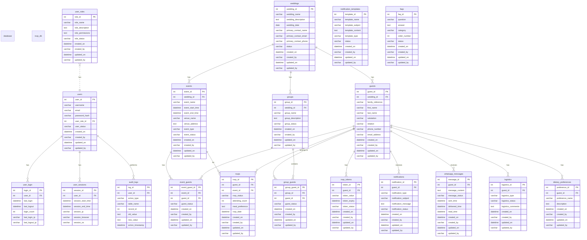

```mermaid
erDiagram
    database "rsvp_db"

    users {
        int user_id PK
        varchar username
        varchar email
        varchar password_hash
        int user_role_id FK
        varchar user_status
        datetime created_on
        varchar created_by
        datetime updated_on
        varchar updated_by
    }

    user_roles {
        int role_id PK
        varchar role_name
        text role_description
        text role_permissions
        varchar role_status
        datetime created_on
        varchar created_by
        datetime updated_on
        varchar updated_by
    }

    user_login {
        int login_id PK
        int user_id FK
        datetime last_login
        datetime last_logout
        int login_count
        varchar last_login_ip
        varchar last_logout_ip
    }

    user_sessions {
        int session_id PK
        int user_id FK
        datetime session_start_time
        datetime session_end_time
        varchar session_ip
        varchar session_browser
        varchar session_os
    }

    weddings {
        int wedding_id PK
        varchar wedding_name
        text wedding_description
        date wedding_date
        varchar primary_contact_name
        varchar primary_contact_email
        varchar primary_contact_phone
        varchar status
        datetime created_on
        varchar created_by
        datetime updated_on
        varchar updated_by
    }

    events {
        int event_id PK
        int wedding_id FK
        varchar event_name
        datetime event_start_time
        datetime event_end_time
        varchar venue_name
        text venue_address
        varchar event_type
        varchar event_status
        datetime created_on
        varchar created_by
        datetime updated_on
        varchar updated_by
    }

    guests {
        int guest_id PK
        int wedding_id FK
        varchar family_reference
        varchar first_name
        varchar last_name
        varchar salutation
        varchar relation
        varchar phone_number
        varchar email_address
        datetime created_on
        varchar created_by
        datetime updated_on
        varchar updated_by
    }

    groups {
        int group_id PK
        int wedding_id FK
        varchar group_name
        text group_description
        varchar group_status
        datetime created_on
        varchar created_by
        datetime updated_on
        varchar updated_by
    }

    group_guests {
        int group_guest_id PK
        int group_id FK
        int guest_id FK
        varchar guest_status
        datetime created_on
        varchar created_by
        datetime updated_on
        varchar updated_by
    }

    event_guests {
        int event_guest_id PK
        int event_id FK
        int guest_id FK
        varchar guest_status
        datetime created_on
        varchar created_by
        datetime updated_on
        varchar updated_by
    }

    rsvps {
        int rsvp_id PK
        int guest_id FK
        int event_id FK
        varchar rsvp_status
        int attending_count
        text meal_preference
        datetime rsvp_date
        datetime created_on
        varchar created_by
        datetime updated_on
        varchar updated_by
    }

    rsvp_tokens {
        int token_id PK
        int guest_id FK
        varchar token_value
        datetime token_expiry
        varchar token_status
        datetime created_on
        varchar created_by
        datetime updated_on
        varchar updated_by
    }

    notifications {
        int notification_id PK
        int guest_id FK
        varchar notification_type
        varchar notification_subject
        text notification_message
        varchar notification_status
        datetime created_on
        varchar created_by
        datetime updated_on
        varchar updated_by
    }

    notification_templates {
        int template_id PK
        varchar template_name
        varchar template_subject
        text template_content
        varchar template_type
        varchar status
        datetime created_on
        varchar created_by
        datetime updated_on
        varchar updated_by
    }

    whatsapp_messages {
        int message_id PK
        int guest_id FK
        text message_content
        varchar message_status
        datetime sent_time
        datetime delivered_time
        datetime read_time
        datetime created_on
        varchar created_by
        datetime updated_on
        varchar updated_by
    }

    logistics {
        int logistics_id PK
        int guest_id FK
        varchar logistics_type
        varchar logistics_status
        text logistics_comments
        datetime created_on
        varchar created_by
        datetime updated_on
        varchar updated_by
    }

    dietary_preferences {
        int preference_id PK
        int guest_id FK
        varchar preference_name
        text description
        datetime created_on
        varchar created_by
        datetime updated_on
        varchar updated_by
    }

    faqs {
        int faq_id PK
        varchar question
        text answer
        varchar category
        int order_number
        varchar status
        datetime created_on
        varchar created_by
        datetime updated_on
        varchar updated_by
    }

    audit_logs {
        int log_id PK
        int user_id FK
        varchar action_type
        varchar table_name
        int record_id
        text old_value
        text new_value
        datetime action_timestamp
    }

    users ||--o{ user_login : "has"
    users ||--o{ user_sessions : "has"
    users ||--o{ audit_logs : "performs"
    user_roles }|..|| users : "has"

    weddings ||--o{ events : "has"
    weddings ||--o{ guests : "has"
    weddings ||--o{ groups : "has"

    events ||--o{ event_guests : "has"
    events ||--o{ rsvps : "for"

    guests ||--o{ group_guests : "belongs to"
    guests ||--o{ event_guests : "attends"
    guests ||--o{ rsvps : "has"
    guests ||--o{ rsvp_tokens : "has"
    guests ||--o{ notifications : "receives"
    guests ||--o{ whatsapp_messages : "receives"
    guests ||--o{ logistics : "has"
    guests ||--o{ dietary_preferences : "has"

    groups ||--o{ group_guests : "contains"
```
